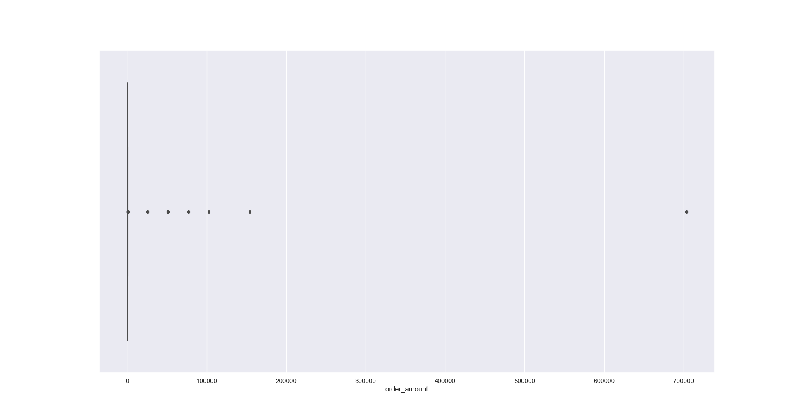
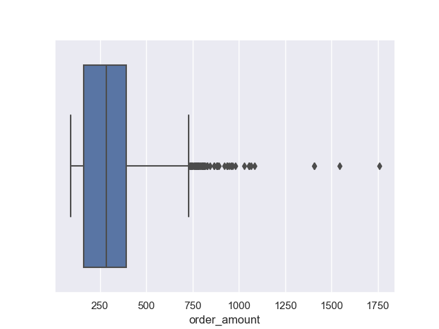

# Shopify Fall 2022 Data Science Intern Challenge
## Question 1:
### Given some sample data, write a program to answer the following:
On Shopify, we have exactly 100 sneaker shops, and each of these shops sells only one model of shoe. We want to do some analysis of the average order value (AOV). When we look at orders data over a 30 day window, we naively calculate an AOV of $3145.13. Given that we know these shops are selling sneakers, a relatively affordable item, something seems wrong with our analysis. 

a. Think about what could be going wrong with our calculation. Think about a better way to evaluate this data. 

b. What metric would you report for this dataset?

c. What is its value?

### Exploratory Analysis:
First, I want to take a glimpse at the given data and replicate the calculation of naive average order value.
```python
# import modules
from matplotlib import style
import pandas as pd
import numpy as np
import seaborn as sns
import matplotlib.pyplot as plt
```
```python
# import dataset
shopify_df = pd.read_csv("shopify_dataset.csv")
print(shopify_df.head) # Look at the first 5 rows of dataset
```
```
Output:
  order_id  shop_id  user_id  order_amount  total_items payment_method           created_at
0         1       53      746           224            2           cash  2017-03-13 12:36:56
1         2       92      925            90            1           cash  2017-03-03 17:38:52
2         3       44      861           144            1           cash   2017-03-14 4:23:56
3         4       18      935           156            1    credit_card  2017-03-26 12:43:37
4         5       18      883           156            1    credit_card   2017-03-01 4:35:11
```
We can use the .mean() function on order_amount column. This is the naive calculation of average order value.
```python
naive_aov = shopify_df['order_amount'].mean()
print("Naive calculation of Average Order Value for the dataset: ${:.2f}".format(naive_aov))
```
```
Output:
Naive calculation of Average Order Value for the dataset: $3145.13
```
This number seems to be wrong with sneakers being affordable goods. We can check the distribution of order_amount to see if there are any outliers.
```python
sns.set(style="darkgrid")
g = sns.boxplot(x = shopify_df['order_amount'])
plt.show()
```


We can also check basic statistics of the order_amount column.
```python
print(shopify_df['order_amount'].describe())
```
```
Ouput:
count      5000.000000
mean       3145.128000
std       41282.539349
min          90.000000
25%         163.000000
50%         284.000000
75%         390.000000
max      704000.000000
Name: order_amount, dtype: float64
```
We can see that majority of order_amount is very small (in hundred of dollars) compared to some outliers (in thousands of dollars). My theory is that there are some stores inputting data incorrectly. 

Let's first check stores that have orders more than $1,000
```python
high_store_set = set()
for index, row in shopify_df.iterrows():
    if int(row['order_amount']) > 1000:
        high_store_set.add(row['shop_id'])
print("Stores that have orders > $1,000: {}".format(high_store_set))
```
```
Output:
Stores that have orders > $1,000: {54, 42, 43, 78}
```
Now we can check each store's orders to see any discrepancies:
```python
for s in high_store_set:
    print('Store {}'.format(s))
    print(shopify_df[shopify_df['shop_id'] == s])
    print('======================================')\
```
```
Output:
Store 54
      order_id  shop_id  user_id  order_amount  total_items payment_method           created_at
12          13       54      799           266            2    credit_card  2017-03-16 14:15:34
104        105       54      803           532            4           cash   2017-03-28 5:30:41
214        215       54      742           399            3    credit_card   2017-03-27 3:28:24
278        279       54      763           266            2           cash   2017-03-29 5:18:09
287        288       54      945           266            2    credit_card  2017-03-23 17:42:29
341        342       54      735           399            3    credit_card  2017-03-17 22:49:05
355        356       54      804           266            2           cash  2017-03-19 15:41:36
429        430       54      762           266            2          debit  2017-03-03 23:40:34
543        544       54      986           266            2    credit_card   2017-03-30 6:07:39
674        675       54      771           133            1    credit_card   2017-03-19 7:16:45
778        779       54      932           399            3    credit_card   2017-03-02 2:15:39
1080      1081       54      873           266            2    credit_card   2017-03-10 6:42:46
1203      1204       54      792           133            1          debit   2017-03-02 8:48:46
1231      1232       54      723           133            1          debit   2017-03-28 4:39:06
1275      1276       54      946           133            1          debit  2017-03-04 16:36:09
1336      1337       54      811           133            1           cash  2017-03-24 20:50:14
1507      1508       54      874           399            3    credit_card   2017-03-16 4:27:47
1772      1773       54      847           133            1           cash   2017-03-14 0:09:34
1778      1779       54      974           266            2    credit_card   2017-03-08 9:02:24
2007      2008       54      865           133            1    credit_card   2017-03-24 9:13:17
2112      2113       54      898           133            1    credit_card  2017-03-25 14:05:07
2114      2115       54      742           133            1          debit  2017-03-27 19:19:56
2141      2142       54      916           266            2           cash   2017-03-30 3:38:34
2254      2255       54      805           266            2           cash   2017-03-28 9:54:06
2390      2391       54      826           133            1    credit_card  2017-03-18 10:39:45
2435      2436       54      980           399            3    credit_card  2017-03-04 16:31:30
2483      2484       54      893           266            2           cash  2017-03-09 15:14:50
2588      2589       54      867           665            5          debit   2017-03-30 6:20:07
2856      2857       54      729           266            2          debit   2017-03-29 6:48:36
2946      2947       54      711           266            2          debit   2017-03-05 5:48:08
3019      3020       54      778           665            5          debit  2017-03-01 19:13:17
3340      3341       54      853           133            1          debit  2017-03-09 12:10:03
3524      3525       54      844           266            2           cash  2017-03-27 20:57:35
3550      3551       54      756           266            2          debit   2017-03-17 3:16:36
3660      3661       54      988           133            1          debit  2017-03-12 15:25:17
3769      3770       54      971           266            2    credit_card  2017-03-08 10:20:21
3772      3773       54      740           266            2          debit   2017-03-20 2:38:56
3861      3862       54      934           133            1          debit   2017-03-08 9:54:19
3868      3869       54      964           133            1    credit_card   2017-03-29 1:36:10
3920      3921       54      914           399            3          debit  2017-03-22 14:16:58
3944      3945       54      723           133            1    credit_card  2017-03-18 16:30:03
4118      4119       54      959           266            2          debit  2017-03-18 19:14:18
4141      4142       54      733          1064            8          debit  2017-03-07 17:05:18
4169      4170       54      791           133            1           cash   2017-03-17 1:19:23
4209      4210       54      877           399            3           cash   2017-03-23 4:37:15
4237      4238       54      755           266            2           cash  2017-03-18 19:41:14
4405      4406       54      808           266            2          debit  2017-03-07 10:11:21
4500      4501       54      920           133            1    credit_card  2017-03-20 15:10:02
4527      4528       54      935           266            2          debit  2017-03-30 20:18:21
4694      4695       54      868           266            2    credit_card  2017-03-25 20:11:31
======================================
Store 42
      order_id  shop_id  user_id  order_amount  total_items payment_method           created_at
15          16       42      607        704000         2000    credit_card   2017-03-07 4:00:00
40          41       42      793           352            1    credit_card  2017-03-24 14:15:41
60          61       42      607        704000         2000    credit_card   2017-03-04 4:00:00
308        309       42      770           352            1    credit_card  2017-03-11 18:14:39
409        410       42      904           704            2    credit_card  2017-03-04 14:32:58
520        521       42      607        704000         2000    credit_card   2017-03-02 4:00:00
834        835       42      792           352            1           cash  2017-03-25 21:31:25
835        836       42      819           704            2           cash  2017-03-09 14:15:15
938        939       42      808          1056            3    credit_card  2017-03-13 23:43:45
979        980       42      744           352            1          debit  2017-03-12 13:09:04
1104      1105       42      607        704000         2000    credit_card   2017-03-24 4:00:00
1362      1363       42      607        704000         2000    credit_card   2017-03-15 4:00:00
1364      1365       42      797          1760            5           cash   2017-03-10 6:28:21
1367      1368       42      926          1408            4           cash   2017-03-13 2:38:34
1436      1437       42      607        704000         2000    credit_card   2017-03-11 4:00:00
1471      1472       42      907          1408            4          debit  2017-03-12 23:00:22
1512      1513       42      946           352            1          debit  2017-03-24 13:35:04
1520      1521       42      756           704            2          debit  2017-03-22 13:10:31
1562      1563       42      607        704000         2000    credit_card   2017-03-19 4:00:00
1602      1603       42      607        704000         2000    credit_card   2017-03-17 4:00:00
1911      1912       42      739           704            2           cash   2017-03-07 5:42:52
1929      1930       42      770           352            1    credit_card   2017-03-17 8:11:13
2003      2004       42      934           704            2           cash   2017-03-26 9:21:26
2018      2019       42      739           352            1          debit  2017-03-01 12:42:26
2053      2054       42      951           352            1          debit  2017-03-19 11:49:12
2153      2154       42      607        704000         2000    credit_card   2017-03-12 4:00:00
2273      2274       42      747           704            2          debit  2017-03-27 20:48:19
2297      2298       42      607        704000         2000    credit_card   2017-03-07 4:00:00
2491      2492       42      868           704            2          debit  2017-03-01 18:33:33
2609      2610       42      868           704            2          debit  2017-03-23 18:10:14
2766      2767       42      970           704            2    credit_card  2017-03-05 10:45:42
2835      2836       42      607        704000         2000    credit_card   2017-03-28 4:00:00
2969      2970       42      607        704000         2000    credit_card   2017-03-28 4:00:00
2987      2988       42      819          1056            3           cash   2017-03-03 9:09:25
3332      3333       42      607        704000         2000    credit_card   2017-03-24 4:00:00
3513      3514       42      726          1056            3          debit  2017-03-24 17:51:05
3651      3652       42      830           352            1    credit_card  2017-03-24 22:26:58
3697      3698       42      839           352            1          debit   2017-03-12 2:45:09
3903      3904       42      975           352            1          debit   2017-03-12 1:28:31
3998      3999       42      886           352            1          debit  2017-03-09 20:10:41
4056      4057       42      607        704000         2000    credit_card   2017-03-28 4:00:00
4231      4232       42      962           352            1           cash   2017-03-04 0:01:19
4294      4295       42      859           704            2           cash  2017-03-24 20:50:40
4326      4327       42      788           704            2          debit  2017-03-16 23:37:57
4421      4422       42      736           704            2    credit_card  2017-03-01 12:19:49
4625      4626       42      809           352            1    credit_card   2017-03-11 8:21:26
4646      4647       42      607        704000         2000    credit_card   2017-03-02 4:00:00
4745      4746       42      872           352            1          debit   2017-03-24 0:57:24
4767      4768       42      720           704            2    credit_card  2017-03-14 10:26:08
4868      4869       42      607        704000         2000    credit_card   2017-03-22 4:00:00
4882      4883       42      607        704000         2000    credit_card   2017-03-25 4:00:00
======================================
Store 43
      order_id  shop_id  user_id  order_amount  total_items payment_method           created_at
189        190       43      928           362            2          debit   2017-03-30 7:00:14
395        396       43      989           362            2          debit  2017-03-21 23:17:39
403        404       43      951           543            3    credit_card  2017-03-01 23:52:31
435        436       43      869           362            2          debit   2017-03-21 1:09:45
645        646       43      929           362            2          debit   2017-03-15 9:32:45
731        732       43      839           181            1           cash  2017-03-11 22:11:43
896        897       43      931           362            2    credit_card  2017-03-28 22:22:11
970        971       43      751           181            1    credit_card   2017-03-23 4:20:01
1109      1110       43      748           543            3          debit  2017-03-17 15:16:56
1172      1173       43      708           181            1          debit   2017-03-11 1:30:15
1475      1476       43      842           181            1           cash  2017-03-17 23:03:57
1490      1491       43      995           181            1           cash  2017-03-08 17:17:34
1537      1538       43      750           543            3    credit_card  2017-03-11 13:20:57
1604      1605       43      764           181            1          debit  2017-03-12 21:56:18
1674      1675       43      785           543            3           cash   2017-03-20 5:25:21
1803      1804       43      840           181            1           cash  2017-03-12 17:53:21
1816      1817       43      788           181            1          debit   2017-03-05 4:01:40
1877      1878       43      838           181            1    credit_card   2017-03-11 7:42:30
2067      2068       43      715           362            2    credit_card  2017-03-24 18:08:28
2241      2242       43      839           362            2    credit_card   2017-03-24 2:45:56
2257      2258       43      848           181            1           cash  2017-03-30 11:02:47
2275      2276       43      913           181            1    credit_card  2017-03-26 12:34:25
2318      2319       43      786           181            1           cash   2017-03-07 3:29:45
2472      2473       43      995           362            2          debit  2017-03-04 12:35:53
2595      2596       43      733           543            3          debit  2017-03-14 18:18:35
2637      2638       43      800           543            3           cash  2017-03-17 17:26:53
2665      2666       43      982           181            1          debit   2017-03-03 2:33:50
2755      2756       43      943           181            1    credit_card   2017-03-12 0:35:04
2786      2787       43      876           724            4    credit_card   2017-03-01 1:41:43
2853      2854       43      913           362            2    credit_card  2017-03-12 17:45:34
2960      2961       43      855           543            3    credit_card  2017-03-29 21:42:54
3044      3045       43      811           181            1          debit  2017-03-16 10:25:04
3068      3069       43      818           362            2          debit   2017-03-30 6:07:44
3098      3099       43      707           181            1           cash  2017-03-20 14:30:52
3177      3178       43      718           362            2          debit  2017-03-08 10:24:58
3212      3213       43      714           362            2           cash  2017-03-22 15:24:50
3241      3242       43      913           181            1          debit   2017-03-27 9:53:09
3275      3276       43      782           362            2    credit_card  2017-03-29 23:25:09
3309      3310       43      745           362            2           cash  2017-03-25 13:24:41
3372      3373       43      978           181            1    credit_card   2017-03-23 9:08:00
3528      3529       43      992           181            1           cash  2017-03-19 11:00:50
3538      3539       43      830          1086            6          debit  2017-03-17 19:56:29
3577      3578       43      918           181            1           cash   2017-03-26 6:47:17
3604      3605       43      925           362            2           cash  2017-03-21 17:12:45
3612      3613       43      725           362            2           cash   2017-03-04 1:40:37
3649      3650       43      936           181            1    credit_card   2017-03-28 2:33:06
3824      3825       43      736           724            4    credit_card  2017-03-25 17:34:51
4123      4124       43      956           181            1          debit   2017-03-07 1:54:03
4210      4211       43      717           543            3    credit_card  2017-03-13 19:40:30
4266      4267       43      985           181            1    credit_card  2017-03-04 21:18:05
4543      4544       43      911           181            1    credit_card  2017-03-30 11:59:02
4568      4569       43      758           181            1    credit_card   2017-03-26 1:46:35
4575      4576       43      875           362            2    credit_card   2017-03-14 8:12:48
4674      4675       43      896           181            1          debit  2017-03-19 13:38:22
4712      4713       43      725           362            2           cash   2017-03-20 6:10:07
4843      4844       43      701           543            3           cash   2017-03-01 9:56:42
4848      4849       43      847           543            3           cash  2017-03-25 22:06:28
4940      4941       43      992           181            1          debit   2017-03-05 9:03:14
======================================
Store 78
      order_id  shop_id  user_id  order_amount  total_items payment_method           created_at
160        161       78      990         25725            1    credit_card   2017-03-12 5:56:57
490        491       78      936         51450            2          debit  2017-03-26 17:08:19
493        494       78      983         51450            2           cash  2017-03-16 21:39:35
511        512       78      967         51450            2           cash   2017-03-09 7:23:14
617        618       78      760         51450            2           cash  2017-03-18 11:18:42
691        692       78      878        154350            6          debit  2017-03-27 22:51:43
1056      1057       78      800         25725            1          debit  2017-03-15 10:16:45
1193      1194       78      944         25725            1          debit  2017-03-16 16:38:26
1204      1205       78      970         25725            1    credit_card  2017-03-17 22:32:21
1259      1260       78      775         77175            3    credit_card   2017-03-27 9:27:20
1384      1385       78      867         25725            1           cash  2017-03-17 16:38:06
1419      1420       78      912         25725            1           cash  2017-03-30 12:23:43
1452      1453       78      812         25725            1    credit_card  2017-03-17 18:09:54
1529      1530       78      810         51450            2           cash   2017-03-29 7:12:01
2270      2271       78      855         25725            1    credit_card  2017-03-14 23:58:22
2452      2453       78      709         51450            2           cash  2017-03-27 11:04:04
2492      2493       78      834        102900            4          debit   2017-03-04 4:37:34
2495      2496       78      707         51450            2           cash   2017-03-26 4:38:52
2512      2513       78      935         51450            2          debit  2017-03-18 18:57:13
2548      2549       78      861         25725            1           cash  2017-03-17 19:36:00
2564      2565       78      915         77175            3          debit   2017-03-25 1:19:35
2690      2691       78      962         77175            3          debit   2017-03-22 7:33:25
2773      2774       78      890         25725            1           cash  2017-03-26 10:36:43
2818      2819       78      869         51450            2          debit   2017-03-17 6:25:51
2821      2822       78      814         51450            2           cash  2017-03-02 17:13:25
2906      2907       78      817         77175            3          debit   2017-03-16 3:45:46
2922      2923       78      740         25725            1          debit  2017-03-12 20:10:58
3085      3086       78      910         25725            1           cash   2017-03-26 1:59:27
3101      3102       78      855         51450            2    credit_card   2017-03-21 5:10:34
3151      3152       78      745         25725            1    credit_card  2017-03-18 13:13:07
3167      3168       78      927         51450            2           cash  2017-03-12 12:23:08
3403      3404       78      928         77175            3          debit   2017-03-16 9:45:05
3440      3441       78      982         25725            1          debit  2017-03-19 19:02:54
3705      3706       78      828         51450            2    credit_card  2017-03-14 20:43:15
3724      3725       78      766         77175            3    credit_card  2017-03-16 14:13:26
3780      3781       78      889         25725            1           cash  2017-03-11 21:14:50
4040      4041       78      852         25725            1           cash  2017-03-02 14:31:12
4079      4080       78      946         51450            2           cash  2017-03-20 21:14:00
4192      4193       78      787         77175            3    credit_card   2017-03-18 9:25:32
4311      4312       78      960         51450            2          debit   2017-03-01 3:02:10
4412      4413       78      756         51450            2          debit   2017-03-02 4:13:39
4420      4421       78      969         77175            3          debit  2017-03-09 15:21:35
4505      4506       78      866         25725            1          debit  2017-03-22 22:06:01
4584      4585       78      997         25725            1           cash  2017-03-25 21:48:44
4715      4716       78      818         77175            3          debit   2017-03-05 5:10:44
4918      4919       78      823         25725            1           cash  2017-03-15 13:26:46
======================================
```
For store 54 and 43, most of their orders are < $1,000, with the exceptions of some orders with greater number of items. Therefore, we can consider keeping the original data in the analysis.

However, for store 42, it seems like the data is input incorrectly in a thousand unit for some orders. Because we can see that for some orders, the order amount is $704 with 2 items, instead of $704,000 with 2,000 items. 

For store 78, we can also safely assume that the order amount was input as cents instead of dollars (eg. an order of 25725 in order amount is equivalent to $257.25)

With these assumptions, we will make changes to the data and calculate a more accurate Average Order Value (AOV).

### Clean Data and Calculate new AOV
```python
# create a new dataframe to make changes
shopify_new_df = shopify_df.copy()

# replace inaccurate data in store 42
shopify_new_df['order_amount'] = shopify_new_df['order_amount'].replace([704000], 704)
shopify_new_df['total_items'] = shopify_new_df['total_items'].replace([2000], 2)

# replace inaccurate data in store 78
shopify_new_df['order_amount'] = np.where(shopify_new_df['shop_id']==78, shopify_new_df['order_amount']/100, shopify_new_df['order_amount'])
```
```python
# check each store again
print('Store 42'.format())
print(shopify_new_df[shopify_new_df['shop_id'] == 42])
print('======================================')
print('Store 78'.format())
print(shopify_new_df[shopify_new_df['shop_id'] == 78])
print('======================================')
```
```
Output:
Store 42
      order_id  shop_id  user_id  order_amount  total_items payment_method           created_at
15          16       42      607         704.0            2    credit_card   2017-03-07 4:00:00
40          41       42      793         352.0            1    credit_card  2017-03-24 14:15:41
60          61       42      607         704.0            2    credit_card   2017-03-04 4:00:00
308        309       42      770         352.0            1    credit_card  2017-03-11 18:14:39
409        410       42      904         704.0            2    credit_card  2017-03-04 14:32:58
520        521       42      607         704.0            2    credit_card   2017-03-02 4:00:00
834        835       42      792         352.0            1           cash  2017-03-25 21:31:25
835        836       42      819         704.0            2           cash  2017-03-09 14:15:15
938        939       42      808        1056.0            3    credit_card  2017-03-13 23:43:45
979        980       42      744         352.0            1          debit  2017-03-12 13:09:04
1104      1105       42      607         704.0            2    credit_card   2017-03-24 4:00:00
1362      1363       42      607         704.0            2    credit_card   2017-03-15 4:00:00
1364      1365       42      797        1760.0            5           cash   2017-03-10 6:28:21
1367      1368       42      926        1408.0            4           cash   2017-03-13 2:38:34
1436      1437       42      607         704.0            2    credit_card   2017-03-11 4:00:00
1471      1472       42      907        1408.0            4          debit  2017-03-12 23:00:22
1512      1513       42      946         352.0            1          debit  2017-03-24 13:35:04
1520      1521       42      756         704.0            2          debit  2017-03-22 13:10:31
1562      1563       42      607         704.0            2    credit_card   2017-03-19 4:00:00
1602      1603       42      607         704.0            2    credit_card   2017-03-17 4:00:00
1911      1912       42      739         704.0            2           cash   2017-03-07 5:42:52
1929      1930       42      770         352.0            1    credit_card   2017-03-17 8:11:13
2003      2004       42      934         704.0            2           cash   2017-03-26 9:21:26
2018      2019       42      739         352.0            1          debit  2017-03-01 12:42:26
2053      2054       42      951         352.0            1          debit  2017-03-19 11:49:12
2153      2154       42      607         704.0            2    credit_card   2017-03-12 4:00:00
2273      2274       42      747         704.0            2          debit  2017-03-27 20:48:19
2297      2298       42      607         704.0            2    credit_card   2017-03-07 4:00:00
2491      2492       42      868         704.0            2          debit  2017-03-01 18:33:33
2609      2610       42      868         704.0            2          debit  2017-03-23 18:10:14
2766      2767       42      970         704.0            2    credit_card  2017-03-05 10:45:42
2835      2836       42      607         704.0            2    credit_card   2017-03-28 4:00:00
2969      2970       42      607         704.0            2    credit_card   2017-03-28 4:00:00
2987      2988       42      819        1056.0            3           cash   2017-03-03 9:09:25
3332      3333       42      607         704.0            2    credit_card   2017-03-24 4:00:00
3513      3514       42      726        1056.0            3          debit  2017-03-24 17:51:05
3651      3652       42      830         352.0            1    credit_card  2017-03-24 22:26:58
3697      3698       42      839         352.0            1          debit   2017-03-12 2:45:09
3903      3904       42      975         352.0            1          debit   2017-03-12 1:28:31
3998      3999       42      886         352.0            1          debit  2017-03-09 20:10:41
4056      4057       42      607         704.0            2    credit_card   2017-03-28 4:00:00
4231      4232       42      962         352.0            1           cash   2017-03-04 0:01:19
4294      4295       42      859         704.0            2           cash  2017-03-24 20:50:40
4326      4327       42      788         704.0            2          debit  2017-03-16 23:37:57
4421      4422       42      736         704.0            2    credit_card  2017-03-01 12:19:49
4625      4626       42      809         352.0            1    credit_card   2017-03-11 8:21:26
4646      4647       42      607         704.0            2    credit_card   2017-03-02 4:00:00
4745      4746       42      872         352.0            1          debit   2017-03-24 0:57:24
4767      4768       42      720         704.0            2    credit_card  2017-03-14 10:26:08
4868      4869       42      607         704.0            2    credit_card   2017-03-22 4:00:00
4882      4883       42      607         704.0            2    credit_card   2017-03-25 4:00:00
======================================
Store 78
      order_id  shop_id  user_id  order_amount  total_items payment_method           created_at
160        161       78      990        257.25            1    credit_card   2017-03-12 5:56:57
490        491       78      936        514.50            2          debit  2017-03-26 17:08:19
493        494       78      983        514.50            2           cash  2017-03-16 21:39:35
511        512       78      967        514.50            2           cash   2017-03-09 7:23:14
617        618       78      760        514.50            2           cash  2017-03-18 11:18:42
691        692       78      878       1543.50            6          debit  2017-03-27 22:51:43
1056      1057       78      800        257.25            1          debit  2017-03-15 10:16:45
1193      1194       78      944        257.25            1          debit  2017-03-16 16:38:26
1204      1205       78      970        257.25            1    credit_card  2017-03-17 22:32:21
1259      1260       78      775        771.75            3    credit_card   2017-03-27 9:27:20
1384      1385       78      867        257.25            1           cash  2017-03-17 16:38:06
1419      1420       78      912        257.25            1           cash  2017-03-30 12:23:43
1452      1453       78      812        257.25            1    credit_card  2017-03-17 18:09:54
1529      1530       78      810        514.50            2           cash   2017-03-29 7:12:01
2270      2271       78      855        257.25            1    credit_card  2017-03-14 23:58:22
2452      2453       78      709        514.50            2           cash  2017-03-27 11:04:04
2492      2493       78      834       1029.00            4          debit   2017-03-04 4:37:34
2495      2496       78      707        514.50            2           cash   2017-03-26 4:38:52
2512      2513       78      935        514.50            2          debit  2017-03-18 18:57:13
2548      2549       78      861        257.25            1           cash  2017-03-17 19:36:00
2564      2565       78      915        771.75            3          debit   2017-03-25 1:19:35
2690      2691       78      962        771.75            3          debit   2017-03-22 7:33:25
2773      2774       78      890        257.25            1           cash  2017-03-26 10:36:43
2818      2819       78      869        514.50            2          debit   2017-03-17 6:25:51
2821      2822       78      814        514.50            2           cash  2017-03-02 17:13:25
2906      2907       78      817        771.75            3          debit   2017-03-16 3:45:46
2922      2923       78      740        257.25            1          debit  2017-03-12 20:10:58
3085      3086       78      910        257.25            1           cash   2017-03-26 1:59:27
3101      3102       78      855        514.50            2    credit_card   2017-03-21 5:10:34
3151      3152       78      745        257.25            1    credit_card  2017-03-18 13:13:07
3167      3168       78      927        514.50            2           cash  2017-03-12 12:23:08
3403      3404       78      928        771.75            3          debit   2017-03-16 9:45:05
3440      3441       78      982        257.25            1          debit  2017-03-19 19:02:54
3705      3706       78      828        514.50            2    credit_card  2017-03-14 20:43:15
3724      3725       78      766        771.75            3    credit_card  2017-03-16 14:13:26
3780      3781       78      889        257.25            1           cash  2017-03-11 21:14:50
4040      4041       78      852        257.25            1           cash  2017-03-02 14:31:12
4079      4080       78      946        514.50            2           cash  2017-03-20 21:14:00
4192      4193       78      787        771.75            3    credit_card   2017-03-18 9:25:32
4311      4312       78      960        514.50            2          debit   2017-03-01 3:02:10
4412      4413       78      756        514.50            2          debit   2017-03-02 4:13:39
4420      4421       78      969        771.75            3          debit  2017-03-09 15:21:35
4505      4506       78      866        257.25            1          debit  2017-03-22 22:06:01
4584      4585       78      997        257.25            1           cash  2017-03-25 21:48:44
4715      4716       78      818        771.75            3          debit   2017-03-05 5:10:44
4918      4919       78      823        257.25            1           cash  2017-03-15 13:26:46
======================================
```

Now we calculate the new Average Order value:
```python
new_aov = shopify_new_df['order_amount'].mean()
print('The new Average Order Value is ${:.2f}'.format(new_aov))
```
```
Output:
The new Average Order Value is $305.69
```
We can now check the distribution of order_amount again with a new boxplot.



The data is now much more condensed.

### Conclusion: An average order value of $305.69 (after modifying data) is a better evaluation of the data.

